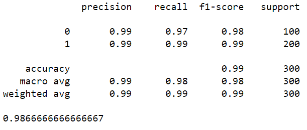

## Solution contre le contrefaçon avec Machine Learning :

Dans ce [Project](./Projet_5.py), je vais construire une banque de solution pour la contrefaçon des monnaies 

J'ai implementé 2 différents models:

- 1 Model supervisé machine learning : **Logistic Regression**
- 1 Model non supervisé : **KMeans**

J'ai entrainé mes modeles avec les dimensions geometrique des vrais billets.

### Préparation des données
J'ai utilisé **une regression Lineaire pour prevoir les valeurs manquantes**.

J'ai utilisé **PCA pour reduire les dimensions, explorer et comprendre la data**.

### KMeans model

### Logistic Regression model

### Application de test :

Après j'ai créé un algorithme pour charger et tester des jeux des données 
